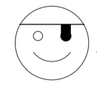
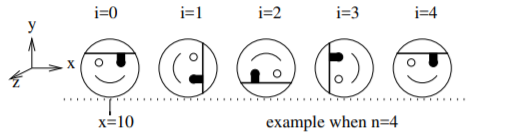

## Pirate Face

This program is to drawing and animating the Pirate Face.

#### Dependencies
- Program should run in `win32` environment and needs `glut` and `opengl` libraries. Requires OpenGL version 3.1 and later. Program has been written with shaders(`glsl`) in modern OpenGL.

#### Program Modes:

**1.** Initially, draws a 2-dimensional pirate face centered at the origin and lying on the x-y
plane.

**2.** When the key ’a’ is pressed, animation mode starts. This mode produces a sequence of drawings of the face rolling along the x-axis, but scaled down to a radius of 1/2 of its original radius and will look like as if the face is rolling. Initial number of rotations is set as 8 in the code.

#### WARNING ####

If you get error like "illegal non-ASCII character" from glsl files, change vshader.glsl and fshader.glsl file endings from crlf to lf, and then run the program again.
#### Yaşar Can Kakdaş
